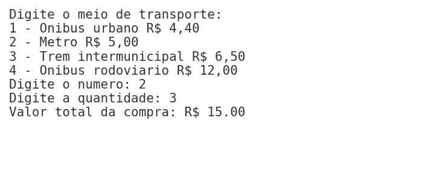
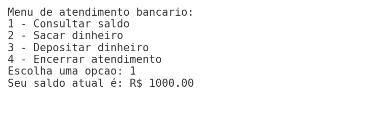
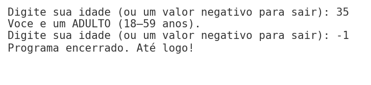

# Projetos com Switch Case em Java

Este repositório contém dois programas em Java demonstrando o uso da estrutura `switch-case` em diferentes contextos.

- **Switchcase.java** — Exibe menus simples (jogos, dias da semana, frutas).
- **Switchcase2.java** — Apresenta menus mais complexos (transporte, banco e faixa etária).

---

## 📝 Descrição dos Arquivos

### 🔹 Switchcase.java
Programa com três blocos independentes:
1. **Menu de jogos** — usuário digita um número de 1 a 5 e o programa retorna o nome de um jogo.
2. **Menu de dias da semana** — usuário digita de 1 a 7 e o programa retorna o dia correspondente.
3. **Menu de frutas** — usuário digita de 1 a 3 e o programa retorna a fruta escolhida.

### 🔹 Switchcase2.java
Programa com três funcionalidades em sequência:
1. **Menu de transporte** — calcula o valor total com base no tipo e quantidade de passagens.
2. **Menu bancário** — consulta saldo, saca e deposita valores até o usuário encerrar.
3. **Classificação por faixa etária** — informa a categoria (criança, adolescente, adulto, idoso) até ser digitado um valor negativo para sair.

---

## 💻 Exemplos de Funcionamento

### Switchcase.java – Menu Jogos

### Switchcase.java – Menu Semana

### Switchcase.java – Menu Frutas

---

### Switchcase2.java – Transporte

### Switchcase2.java – Banco

### Switchcase2.java – Faixa Etária

---

